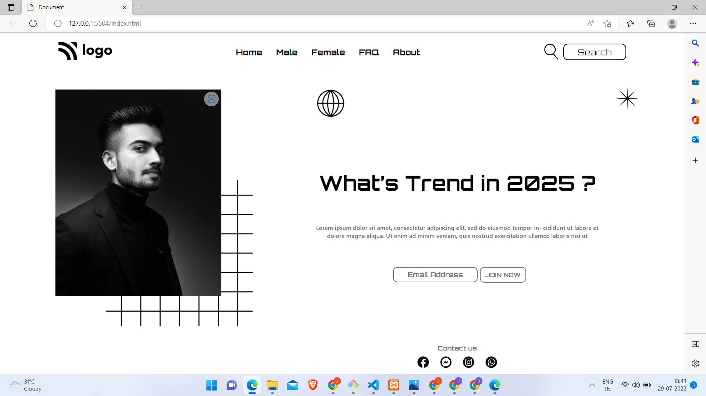

# Street Style Landing Page 

 

 

Output with only HTML code..

Output After Writting Css Code..

##   

> ##  Project 1   [Live Link](https://live-class-project-01.netlify.app/)

## 🛠 Skills Gained in this project

>  This was the Landing page Template Design Given to convert it into ``HTML`` and ``CSS``.
> - Learnd to use css position  **[Relative & Absolute]** property.
>- Learned to use pseudo classes like :nth-child(), :not(), :last-child, first-child
>- Learned to create underline on navbar link using ::after & ::before pseudo elements.

> ## Time taken to finish this project - Complete 3 hrs
